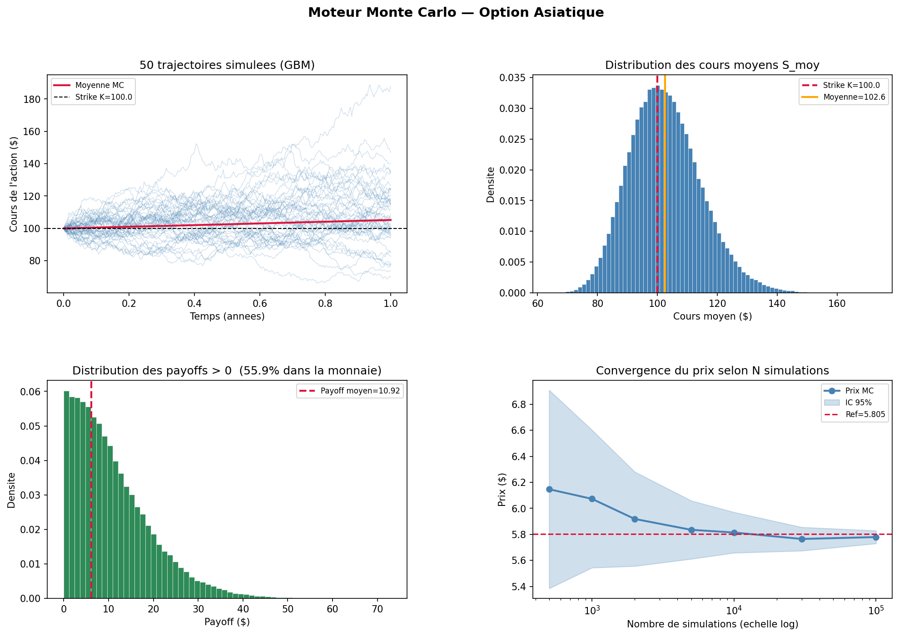

# Moteur_tarif_MC

**Moteur de tarification Monte Carlo pour options asiatiques, validé contre une formule fermée analytique.**



---

## 🇫🇷 Version française

### Aperçu

Une option asiatique dépend de la **moyenne** du cours de l'actif sur toute sa durée de vie, pas seulement du cours final — il n'existe pas de formule fermée simple pour la variante à moyenne arithmétique, d'où le recours à Monte Carlo. Ce projet implémente un moteur de pricing complet :

1. Simulation de trajectoires par mouvement brownien géométrique (schéma d'Euler-Maruyama, vectorisé)
2. Calcul du payoff (moyenne arithmétique ou géométrique, call ou put)
3. Actualisation risque-neutre et intervalle de confiance à 95% sur l'erreur Monte Carlo
4. Analyse de convergence du prix selon le nombre de simulations

### Résultat clé : validation contre une formule fermée

L'option asiatique à moyenne **arithmétique** n'a pas de solution analytique, ce qui rend son prix Monte Carlo difficile à vérifier indépendamment. Mais l'option à moyenne **géométrique** en a une (la moyenne géométrique d'un mouvement brownien géométrique reste log-normale) — c'est la formule de Kemna-Vorst (1990), avec la correction de variance pour un suivi discret (`(N+1)(2N+1)/(6N²)` au lieu de `1/3` en continu).

J'utilise cette formule fermée comme **test de validation du moteur** : en pricant l'option géométrique par Monte Carlo et en la comparant à sa valeur théorique exacte, j'obtiens un écart de l'ordre de l'erreur standard Monte Carlo elle-même — la preuve que la simulation, le calcul du payoff et l'actualisation sont corrects, avant de faire confiance au prix (non vérifiable analytiquement) de l'option à moyenne arithmétique qui est l'objectif réel du projet.

Exemple (S₀=100, K=100, r=5%, σ=20%, T=1 an, 100 000 simulations) :

| Option | Prix Monte Carlo | IC 95% |
|---|---|---|
| Call asiatique (arithmétique) | **5.79 $** | [5.74, 5.84] |
| Put asiatique (arithmétique) | **3.36 $** | [3.33, 3.39] |

### Structure du projet

```
Moteur_tarif_MC/
├── moteur_mc.py         # Moteur complet : simulation, payoff, pricing, convergence, visualisation
├── resultats_mc.png      # Graphiques générés (trajectoires, distribution, convergence)
├── tests/
│   └── test_moteur_mc.py  # Validation contre la formule fermée + tests de propriétés
├── requirements.txt
└── LICENSE
```

### Installation

```bash
git clone <url-du-dépôt>
cd Moteur_tarif_MC
python -m venv venv
source venv/bin/activate        # Windows : venv\Scripts\activate
pip install -r requirements.txt
```

### Utilisation

```bash
python moteur_mc.py
```

Affiche le prix du call et du put asiatiques, une analyse de convergence, et génère `resultats_mc.png` (4 graphiques : trajectoires simulées, distribution des cours moyens, distribution des payoffs, convergence du prix).

### Tests

```bash
pytest tests/
```

Le test principal compare le prix Monte Carlo de l'option géométrique à sa formule fermée (écart attendu < 5× l'erreur standard MC). Les autres tests vérifient les propriétés de base (prix croissant avec la volatilité, option très hors-la-monnaie proche de zéro, erreur standard qui diminue avec le nombre de simulations, formes de tableaux).

### Stack technique

Python · NumPy · SciPy · Matplotlib · pytest

### Limites & pistes d'amélioration

- Schéma d'Euler-Maruyama simple (pas de réduction de variance : antithétique, variables de contrôle) — la précision pourrait être améliorée à budget de calcul égal.
- Un seul modèle sous-jacent (GBM à volatilité constante) — pas de smile de volatilité.

---

## 🇬🇧 English version

### Overview

An Asian option depends on the **average** price of the underlying over its whole life, not just the final price — there is no simple closed-form solution for the arithmetic-average variant, hence Monte Carlo. This project implements a complete pricing engine:

1. Path simulation via geometric Brownian motion (vectorized Euler-Maruyama scheme)
2. Payoff computation (arithmetic or geometric average, call or put)
3. Risk-neutral discounting and a 95% confidence interval on the Monte Carlo error
4. Convergence analysis of the price as the number of simulations grows

### Key result: validation against a closed form

The **arithmetic**-average Asian option has no analytical solution, which makes its Monte Carlo price hard to verify independently. But the **geometric**-average option does (the geometric average of a geometric Brownian motion stays log-normal) — this is the Kemna-Vorst (1990) formula, with the variance correction for discrete monitoring (`(N+1)(2N+1)/(6N²)` instead of the continuous `1/3`).

I use this closed form as an **engine validation test**: pricing the geometric option by Monte Carlo and comparing it to its exact theoretical value gives a gap on the order of the Monte Carlo standard error itself — proof that the simulation, payoff computation and discounting are correct, before trusting the (analytically unverifiable) price of the arithmetic-average option that is the project's actual goal.

Example (S₀=100, K=100, r=5%, σ=20%, T=1 year, 100,000 simulations):

| Option | Monte Carlo price | 95% CI |
|---|---|---|
| Asian call (arithmetic) | **$5.79** | [5.74, 5.84] |
| Asian put (arithmetic) | **$3.36** | [3.33, 3.39] |

### Project structure

```
Moteur_tarif_MC/
├── moteur_mc.py         # Full engine: simulation, payoff, pricing, convergence, visualization
├── resultats_mc.png      # Generated charts (paths, distribution, convergence)
├── tests/
│   └── test_moteur_mc.py  # Closed-form validation + property tests
├── requirements.txt
└── LICENSE
```

### Installation

```bash
git clone <repo-url>
cd Moteur_tarif_MC
python -m venv venv
source venv/bin/activate        # Windows: venv\Scripts\activate
pip install -r requirements.txt
```

### Usage

```bash
python moteur_mc.py
```

Prints the Asian call and put prices, a convergence analysis, and generates `resultats_mc.png` (4 charts: simulated paths, average-price distribution, payoff distribution, price convergence).

### Tests

```bash
pytest tests/
```

The headline test compares the geometric option's Monte Carlo price to its closed form (expected gap < 5x the MC standard error). Other tests check basic properties (price increasing with volatility, a deep out-of-the-money option near zero, standard error shrinking with more simulations, array shapes).

### Tech stack

Python · NumPy · SciPy · Matplotlib · pytest

### Limitations & next steps

- Plain Euler-Maruyama scheme (no variance reduction: antithetic variates, control variates) — accuracy could improve at the same compute budget.
- Single underlying model (constant-volatility GBM) — no volatility smile.

---

## Author

**Deo ZANTOKO** — Engineering student in Applied Mathematics, Mathematical Modelling for Finance & Insurance (MMFA), CY Tech

## License

MIT — see [LICENSE](LICENSE).
